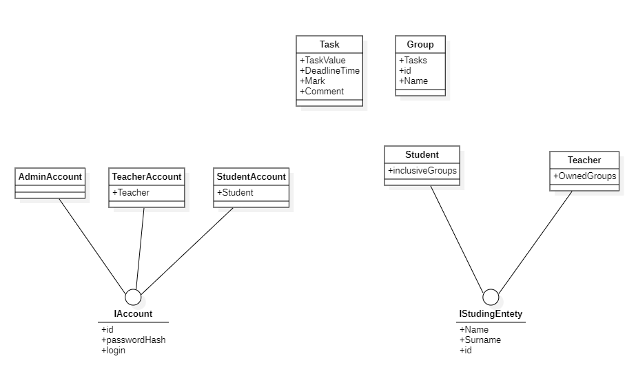
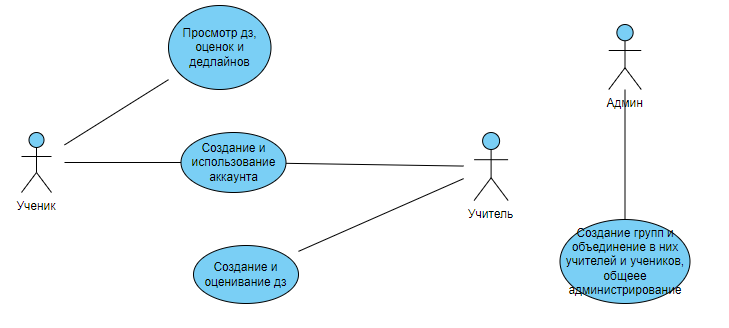

# Учет успеваемости учеников

## Функционал

- Реалиция рейтинга студента в рамках определенной группы(направление, ВУЗ, ...)
- Возможность использования БД
- Табличное форматирование вывода консоли
- Реализация интерфейса взаимодейстия как для ученика, так и для учителя
- Реализация доступа к данным посредстом аккаунта
## Сущности 

## Use Case Diagram
